<h1 align="center">Type It Fast</h1>

[View the live site here](https://begumdev.github.io/Type-It-Fast/)

## Contents
1. [User Experience](#user-experience-ux)
2. [Features](#features)
3. [Technologies Used](#technologies-used)
4. [Testing](#testing)
5. [Deployment](#deployment)
6. [Credits](#credits)

## User Experience (UX)
***
- ### User Stories
    - #### Visitor Goals
    1. I want to be able to find help if I dont understand the game without much distraction.
    2. I want to be able to type in my answers and immediately see how it impacts my score.
    3. I want to be able to contact the organisation with easy navigation.
- ### Design
    - #### Color Scheme
        

The main colours used are; #3DBE57, #3DBE98, #3DA4BE, #3D63BE, #573DBE, #983DBE and #ffffff.

        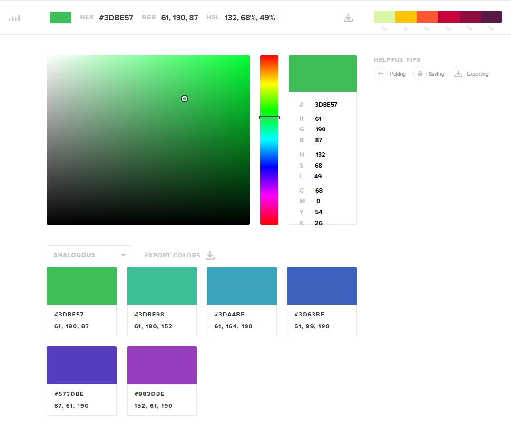

        
    - #### Typography
        - The fonts used were taken from Google fonts named 'Mukta' with a fall back of Sans-Serif.
- ### Wireframes
    

Homepage

    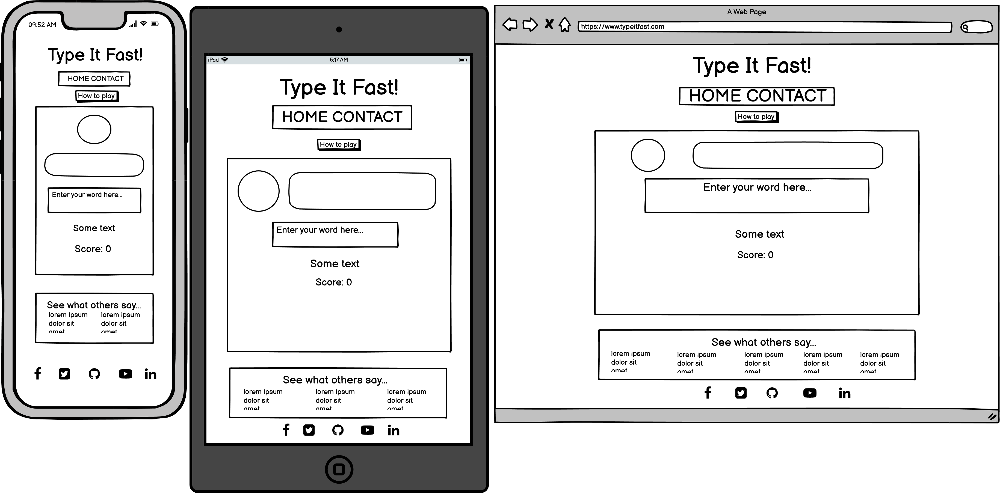
    

    

Contact Page

    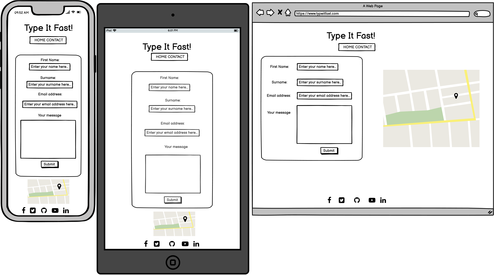
    

## Features
***
- ### The start up modal.
    - Designed to introduce the user to the game, this modal has a clickable button which transfers control to them when they are ready to start the game. Upon clicking 'Start Game' the game will begin.

    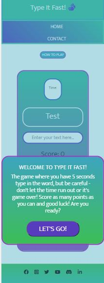

- ### Input focus.
    - As soon as the game begins, the area where the user will type their word has an automatic focus to prompt the user to start typing and avoid losing time. It also has placeholder text to direct the user as to what they are to do.

    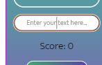

- ### Countdown timer
    - As soon as the game begins, the timer will start to countdown with clear visibility. The element of a countdown is to make the game time pressured to make it more competitive.

    !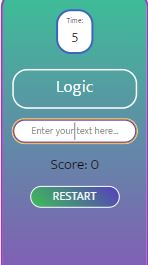

- ### The 'how to play' button
    - Whilst fully expandable upon click, this 'how to play' is to reinforce the rules of the game lest the user needs refreshing. It also features a close button to hide away again to avoid user distraction.

    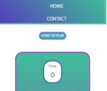
    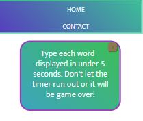

- ### Restart button
    - A bold button encourages the user to re-try another attempt should they wish. Once clicked it will restart the game and restart the stats.

    

- ### Game messages - COME BACK TO THIS
    - Prompt messages are displayed throughout to motivate the user once an answer matches or if the time has run out and its game-over.
- ### Score display.
    - The score is displayed clearly and will increment upon correct answers to keep the user informed of their progress throughout.

    

- ### Footer links to social media pages opened externally.
    - The minimalistic footer is designed place focus on social media connections with fully navigating links to the external sites. Once hovered over the icons, the mouse icon changes showing a clickable hand.

    

- ### A guided contact form fully integrated with an email service.
    - A fully functioning contact form allows the user to input their details and send us an email - with placeholder texts guiding them along the way. All fields are required with its associated input type to avoid sending in error.

    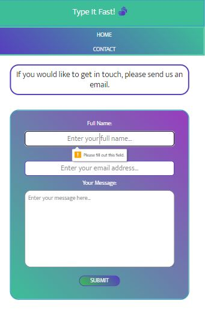

- ### Google maps showing office location and interactive marker.
    - A handy map is placed to show a fictatious office location with an interactive marker which once clicked on, displays the office address and contact number.

    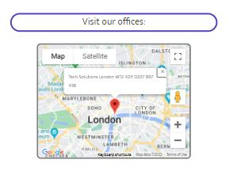

### Future Features:
1. A next level to the game - This requires a bit more planning without complicating the current code and will be tested again in the future.
2. A highscore table - with time constraints I couldn't add this feature but will be tested in the future.

## Technologies Used
***
- ### Frameworks, Libraries and Programs used.
    * Gitpod - This was used to create the code for the website.
    * Git - Git was used for version control by utilizing the Gitpod terminal to commit to Git and push to GitHub.
    * Github - This was used to store the projects code after being pushed from Git.
    * Bootstrap - Bootstrap was used to assist with responsiveness on different media screens.
    * Font Awesome - Icons were used to add detailing to the header.
    * Google Maps API - This was used an API to display a map and marker on the contact page.
    * Email.js - This was used as a means for the user to be able to send an email through.
    * JSDocs - This was used to understand how to annotate code.
    * Balsamiq - Used to construct wireframes of the website.

## Testing
***

* ### Testing user stories from user experience (UX).
    1. I want to be able to find help in how to play the game without much distraction.
    

Results

    * On loading the start up page, the user is met with a modal consuming the page.

    

    * On this modal the user is given clear instructions as to how to play the game.
    * Click on the start button and the game will begin.
    * If the user is still unsure, the user can click on the 'how to play' button which will show the instructions once again with a closing button to hide away again.

    
    
    

    2. I want to be able to type in my answers and immediately see how it impacts my score.
    

Results

    * As soon as the game starts, the word input box has a auto focus ready for them to type.

    
        
    * Every time the users answer matches, the message will display "Well done!" COME BACK TO THIS*****

    * If the answer is correct, the score will increment updating them in real time.

    
    

    3. I want to be able to contact the organisation with easy navigation.
    

Results

    * A contact tab is placed in the header menu.

    

    * Click on this link and it will take you to our contact form.
    * Each input field has a label describing what is to go in aswell as placeholder text.

    

    * All input fields are required to have text put in otherwise the form will not send.
    * Once all fields are complete, click the submit button which then acknowledges the email has been sent and gives a message to the user letting them know we will be in touch shortly.

    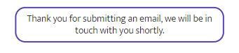
    

* ### Code Validation.
    - W3C HTML Validation.
    

See results here

    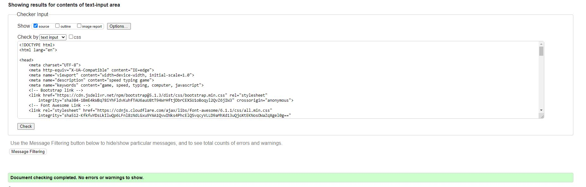
    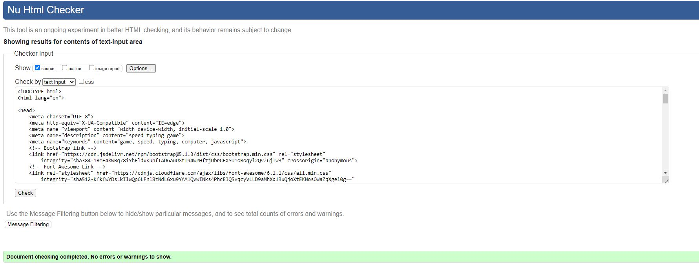
    

    - Jigsaw CSS Validation.
    

See results here

    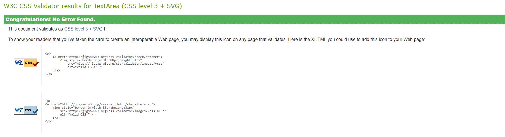
    

    - JShint for Javascript.

    - Lighthouse Testing.

* ### Automated Testing
    - Jest Testing - this was used to test units from my code.
    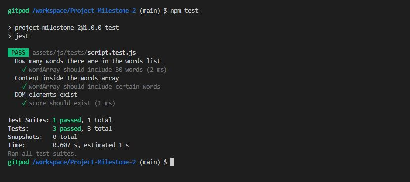

* ### Supported screens and browsers.
    - Mobiles - Samsung Galaxy S9+, IPhone 12 Pro, Samsung Galaxy S20 Ultra, IPhone X
    - Tablets - Ipad Mini, IPad Air, Samsung Galaxt A51/A71, IPad, IPad Pro
    - Laptops

* ### Known bugs.
    - At present, the words display at random however they are not set to populate as unique thus duplication occurs. This will be coded to display a word once and be removed from the array in the future.

* ### Fixed bugs.
    - Score increments despite timer reaching 0.
        * Remove wordInput upon timer reaching 0 and display again on the restart function.
    - Timer kept running in the background despite not being shown on the interface.
        * Added a clearInterval function to stop the timer when it reaches 0.
    - Fix bug in contact form which kept allowing emails to be sent without having filled out all fields of the form.
        * Applied 'required' to the input tag.

## Deployment
***
- ### Create the initial reposotory
    * Once you sign into Github, click on 'new' on the left side of the page.
    * Add a template if needed and a repository name with an optional description.
    * Click 'create' repository.
    * Once created - click on the green 'Gitpod' button which will open your workspace. (Note that you only need to access the workspace using Github for the first time).
- ### Gitpod
    * The repository can be accessed from Gitpod by clicking on the 'dashboard' and finding the repo you need. Once you find the repo - you can click on the vertical 3 dots next to it and then 'open.'
    * Once files were added, the following commands were used to manage the workspace;
        * 'git add (+ file name)' for adding individual files or 'git add .' for adding several files.
        * 'git status' can be used to check what files have been added.
        * 'git commit -m (+ commit message)' will commit the files.
        * 'git push' will push these files up to Github.
- ### Github Pages
    * The project was deployed to GitHub Pages using the following steps;
    * Log in to GitHub and locate the GitHub Repository.
    * At the top of the Repository, click on the 'settings' button.
    * Scroll down the settings page until you find the "GitHub Pages" section.
    * Under 'Source', click the dropdown called 'None' and select the branch as 'Main.'
    * The page will automatically refresh.
    * Scroll back through the page to locate the now published site link in the 'GitHub Pages' section.

## Credits
***
 - ### Code
    * Jest testing wasn't acknowledging my event listeners thus causing tests to fail running. Alex from Code Institute tutor supports had talked me through the error.
 - ### Acknowledgements
    * I would like to credit the Slack community for their ongoing support in being approachable when not understanding something.
    * Dave Horrocks has also been a great help in pointing out an error in my code whereby the timer continued in the background and didnt have a clearInterval function.